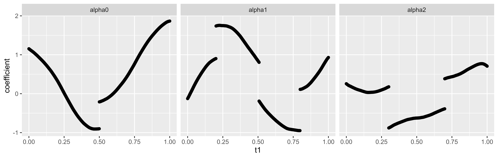
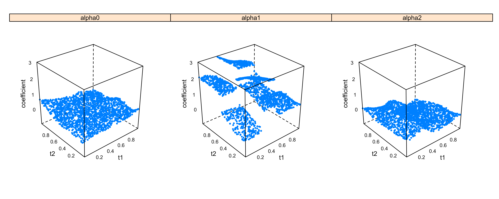

# SVCJP: Semi-varying coefficient model with jump points

This package is designed to estimate the semi-varying coefficient model with an unknown number of jump discontinuities (SVCJP). As a flexible and widely applicable extension of the linear regression model, semi-varying coefficient model has been extensively studied in medical and economic research, usually under the assumption that all coefficient functions are globally continuous. However, plenty of examples in scientific
and business investigations have suggested such an assumption unrealistic.  

We develop a two-stage semi-parametric estimation approach that can perform jump detection and coefficient estimation for the SVCJP model. The total number, locations and sizes of the jumps are determined using one-sided kernels, and the regression coefficients are estimated through the local polynomial method.

## Installation
You can install SVCJP from GitHub using devtools. It should install in 1 minute, but may take longer if you need to update dependencies.  

``` r
library(devtools)
devtools::install_github("chrystal23/SVCJP")
```

## Tutorial

The main function SVCJP requires the following inputs:

### Inputs

- `tin` A matrix containing the observed values of the index variables. Each column corresponds to one index variable.
- `yin` A vector containing the observed values of the response.
- `xin` A matrix containing the observed values of the covariates with varying coefficients. Each column corresponds to one covariate.
- `zin` A matrix containing the observed values of the covariates with linear (non-varying) coefficients. Each column corresponds to one covariate.
- `win` A vector of weights for each observation. If win = NULL (Default), equal weights will be assigned.
- `zeta` The threshold value for change point (jump) detection. If zeta = NULL (Default), the threshold function will be calculated based on theoretical results.
- `bw.seq1` A vector containing the candidate values for bandwidth selection in Part 1 (for h_1). If bw.seq1 = NULL (Default), the candidate values will be generated based on theoretical results.
- `bw.seq2` A vector containing the candidate values for bandwidth selection in Part 2 (for h_tau, h_d, and h_2). If bw.seq2 = NULL (Default), the candidate values will be generated based on theoretical results.
- `kernel` The smoothing kernel used for estimation, including "epan" (Default, the Epanechnikov kernel), "rect", "gauss", "gausvar", and "quar".
- `NbGrid` The number of grid points used for jump detection in each index dimension. Default is 101.
- `nRegGrid` The number of grid points to generate output estimation, mainly for plotting purpose. Default is 101.
- `kFolds` The number of folds for bandwidth cross validation selection. Default is 5.
- `npoly` The degree of polynomial. Default is 1 for local linear smoothing.
- `nder` The order of derivative, which should be smaller than npoly. Default is 0 for local linear smoothing.
- `hkappa` A numeric value (> 1) for neighborhood width adjustment in jump detection to avoid repeated identification of the same jump. Default is 2.
- `Refine` A boolean indicating whether to perform the Refining Stage (iterative refining) in jump detection.
- `refine_tol` The tolerance value for the Refining Stage. Default is 1e-4.
- `refine_maxiter` The maximum number of iterations allowed in the Refining Stage. Default is 10.
- `verbose` A boolean indicating whether to output more information during function execution. Default is TRUE.

The SVCJP function returns a list of estimation results: 

 ### Outputs

- `beta_hat`: A vector of estimated linear coefficients.
- `alp_est`: A list of estimated varying coefficient functions, including detected change point locations (jumptime), estimated jump sizes (jumpsize), and the estimated coefficient function values on the inputs (alp.hat)
- `yhat`: A vector of estimated response given the input.
- `mse`: The mean squared error of response.
- `tuning_parameters`: The tuning parameters selected for our SVCJP method, including h_1, h_tau, h_d, h_2, zeta, and rho_d.
- `...`: Other estimation results.

### Examples
An example input data with one index variable can be loaded using
```r
data(syn_data_1d)
```
which include an example response vector (length 2000) `yin`, a linear-coefficient covariate matrix (2000 x 2) `zin`, a varying-coefficient covariate matrix (2000 x 2) `xin`, and an index variable matrix (2000 x 1) `tin`. To implement our SVCJP method on this example data to detect jumps and estimate coefficients, we run
```r
res_1d <- SVCJP(tin = tin, yin = yin, xin = xin, zin = zin)
#> Part 1: Estimation of the linear part.
#> Bandwidth for Part 1: h_1 = 0.0141032264316281
#> Part 2: Estimation of the nonparametric part.
#> Selecting tuning parameters (h_tau, h_d, h_2) for Part 2 ...
#> Bandwidths for Part 2: h_tau = 0.11793200278167; h_d = 0.183449782104819; h_2 = 0.121207891747827
#> Threshold: zeta = 0.419961504585789
#> Searching Stage starts...
#> Refining is not needed when m=1.
#> Jump detection results:
#>   alpha_0 no. 1 dimension --- jump location: 0.5  jump size: 0.688986924366104
#>   alpha_1 no. 1 dimension --- jump location: 0.201986962169702, 0.507641359944367, 0.798013037830298  jump size: 0.835185426234261, -0.993902396429124, 1.0587339838777
#>   alpha_2 no. 1 dimension --- jump location: 0.301324641446468, 0.698675358553532  jump size: -1.05791239105677, 0.771911159896618
#> MSE: 0.498646946595941
```
Here we leave other arguments as default so the the tuning parameters are calculated based on theoretical results or selected through cross validation by default, but users can also specify the tuning parameters via other function arguments if they have any prior knowledge.
The selected tuning parameters and detected jumps can be directly viewed in console outputs. Meanwhile, the complete estimation results, including the estimated jumps and coefficients, are stored in `res_1d`, and can be called using the following code:
```r
# linear coefficients
res_1d$beta_hat
# jump locations for alpha_j (the coefficient function for the j-th covariate in xin) over the index variable
res_1d$alp_est[[j+1]][[l]]$jumptime
# the corresponding jump sizes
res_1d$alp_est[[j+1]][[l]]$jumpsize
# the estimated coefficient values of alpha_j for the n input data points
res_1d$alp_est[[j+1]]$alp.hat
```
The estimated varying coefficients can be visualized:
```r
pdat_1d = data.frame(t1 = rep(tin[,1], dim(xin)[2]+1),
                     coefficient = do.call(c, lapply(1:(dim(xin)[2]+1), function(j) res_1d$alp_est[[j]]$alp.hat)),
                     term = do.call(c, lapply(1:(dim(xin)[2]+1), function(j) paste0('alpha', rep(j-1, dim(xin)[1])))))
library(ggplot2)
ggplot(pdat_1d, aes(x = t1, y = coefficient)) + geom_point() + facet_wrap(~term)
```


---
The SVCJP function can be similarly applied to an example data with two index variables:
```r
data(syn_data_2d)
res_2d <- SVCJP(tin = tin, yin = yin, xin = xin, zin = zin)
#> Part 1: Estimation of the linear part.
#> Bandwidth for Part 1: h_1 = 0.0599387123344194
#> Part 2: Estimation of the nonparametric part.
#> Selecting tuning parameters (h_tau, h_d, h_2) for Part 2 ...
#> Bandwidths for Part 2: h_tau = 0.10482844691704; h_d = 0.366899564209639; h_2 = 0.235864005563339
#> Threshold: zeta = 0.435045982691555
#> Searching Stage starts...
#> Refining Stage starts...
#> iteration 1
#> Refining stage successfully converges.
#> Jump detection results:
#>   alpha_0 no. 1 dimension --- no jump.
#>   alpha_1 no. 1 dimension --- jump location: 0.30241422345852, 0.60274460380157  jump size: 1.22728045873697, -1.11448703623094
#>   alpha_2 no. 1 dimension --- jump location: 0.5  jump size: -0.938222875732815
#>   alpha_0 no. 2 dimension --- no jump.
#>   alpha_1 no. 2 dimension --- jump location: 0.5  jump size: 0.948264905268609
#>   alpha_2 no. 2 dimension --- no jump.
#> MSE: 0.513229916702457
```
The estimation results for this example can be also be accessed through:
```r
# linear coefficients
res_2d$beta_hat
# jump locations for alpha_j (the coefficient function for the j-th covariate in xin) over t_l (the l-th index dimension)
res_2d$alp_est[[j+1]][[l]]$jumptime
# the corresponding jump sizes
res_2d$alp_est[[j+1]][[l]]$jumpsize
# the estimated coefficient values of alpha_j for the n input data points
res_2d$alp_est[[j+1]]$alp.hat
```
The estimated varying coefficients need to be shown using 3D visualization this time:
```r
pdat_2d = data.frame(t1 = rep(tin[,1], dim(xin)[2]+1),
                     t2 = rep(tin[,2], dim(xin)[2]+1),
                     coefficient = do.call(c, lapply(1:(dim(xin)[2]+1), function(j) res_2d$alp_est[[j]]$alp.hat)),
                     term = do.call(c, lapply(1:(dim(xin)[2]+1), function(j) paste0('alpha', rep(j-1, dim(xin)[1])))))

lattice::cloud(coefficient~t1*t2 | term, data = pdat_2d, 
               pch = 19, cex = 0.3, 
               zlab=list(rot=90), scales = list(arrows=F), 
               par.settings = list(axis.line=list(col="transparent"),
                                   fontsize = list(text = 9))) 
```


